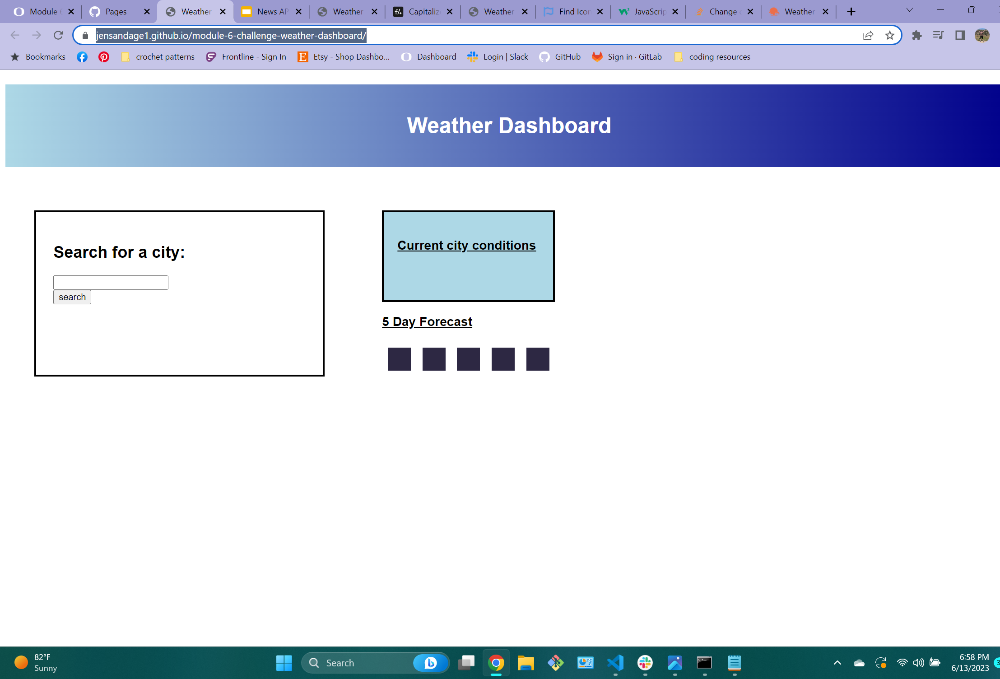

# module-6-challenge-weather-dashboard
## Description 

This is a weather dashboard. 

Screenshots of live application:

[screenshot of weather app before user input](screenshot-weather-app.png)llenge-daily-planner/

Your site is live at https://jensandage1.github.io/module-6-challenge-weather-dashboard/?

## Installation

N/A

## Usage

This webpage displays the current weather as well as a 5 day forecast when presented with a city name. There are also buttons created from the previous city searches. When the user clicks those buttons it will display the current weather and 5 day forecast for that city. 

## Credits

N/A

## License

Please refer to the LICENSE in the repo.

---

## Badges

## Features

## How to Contribute

## Tests
